# 基於OpenWrt作業系統下運行AWS IoT GreenGrass Version 2


AWS IoT Greengrass Version 2是一種開源物聯網 (Internet of Thing, IoT) 邊緣運行(Edge Computing)時和雲端服務(Cloud Service)，可協助您在設備上構建、部署和管理 IoT 應用程序。您可以使用 AWS IoT Greengrass Version 2來建置軟體，使您的設備能夠對它們生成的數據進行本地操作、基於機器學習模型運行預測以及過濾和彙總設備數據。AWS IoT Greengrass Version 2使您的設備能夠在距離數據生成位置更近的位置收集和分析數據，自主回應本地事件，並與本地網路上的其他設備進行安全通訊。運行AWS IoT Greengrass Version 2的設備還可以與 AWS IoT Core進行安全的通訊，並將IoT數據導至 AWS的雲端服務上。您可以使用AWS IoT Greengrass Version 2使用預先構建好的的軟體元件(稱之為Component)來建構邊緣應用程序，這些軟體元件可以將您的邊緣設備連接到AWS上的其他服務或第三方服務。您還可以使用AWS IoT Greengrass Version 2使用Lambda函數、Docke容器、原生作業系統處理程序或您選擇的自訂程序來封裝和運行您的軟體。根據AWS官方文件，目前AWS IoT Greengrass Version 2所支援的硬體平台與作業系統(Operating System, OS)如下表所示。


| CPU架構        | 作業系統 |
| -------------- | -------- |
| Armv7l         | Linux    |
| Armv8(AArch64) | Linux    |
| x86_64         | Linux    |


下圖演示AWS IoT Greengrass的裝置是如何與AWS IoT Greengrass雲端服務以及其他AWS服務的互動。


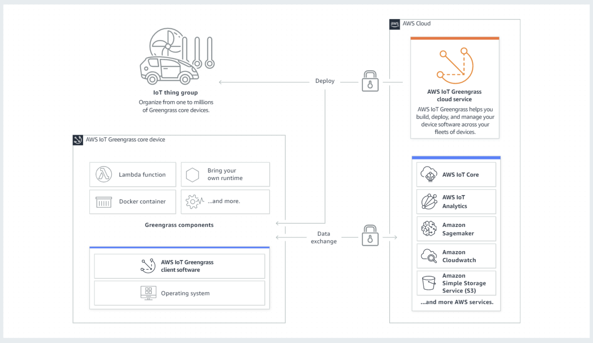


而在廣大的嵌入式作業系統中，OpenWrt是一個適合用於嵌入式裝置的一個Linux發行版本，目前市面上許多的嵌入式硬體平台皆採用以OpenWrt作為其基礎，例如路由器(Network Router)、網路閘道(Network Gateway)或工業用電腦，藉由在OpenWrt上運行AWS IoT Greengrass Version 2，將使其在雲端上強大的功能帶至邊緣端設備。由於目前AWS IoT Greengrass Version 2尚未正式支援OpenWrt上的運行，在本文中我將向您說明如何基於在OpenWrt作業系統下運行AWS IoT Greengrass Version 2，並透過範例演示AWS IoT Greengrass Version 2強大的功能，其中搭配使用的硬體平台為Raspberry Pi 4。


### 先決條件與事前準備

在您進行本文中的技術操作與範例演示之前，請先確認以下的開發環境與需求。

1. 一台可以進行OpenWrt原始碼編譯的個人電腦或筆記型電腦，建議搭配Ubuntu 18.04或較新的Linux作業系統版本，本文採用的是Ubuntu 18.04。
2. 一個註冊的AWS帳號，可參考此[鏈結](https://aws.amazon.com/tw/premiumsupport/knowledge-center/create-and-activate-aws-account/)進行AWS帳號申請，每個AWS帳號皆有提供相關服務的免費額度，關於服務免費額度的相關訊息可參考此[鏈結](https://aws.amazon.com/tw/free/?all-free-tier.sort-by=item.additionalFields.SortRank&all-free-tier.sort-order=asc&awsf.Free%20Tier%20Types=*all&awsf.Free%20Tier%20Categories=*all)。
3. 一個Raspberry Pi 4硬體開發平台。
4. 選項：AWS Command Line Interface(AWS CLI)，可以讓您使用命令列的方式來使用AWS相關服務，請參考此[鏈結](https://aws.amazon.com/cli/?nc1=h_ls)在適合您的作業系統環境下安裝AWS CLI。


### OpenWrt

目前由OpenWrt論壇所提供給Raspberry Pi 4的映象檔是基於musl-c所編譯產生(可參考此[鏈結](https://openwrt.org/toh/raspberry_pi_foundation/raspberry_pi))，因為目前AWS IoT Greengrass Version 2尚未支援musl-c，本節將帶您建置基於glib-c所編譯出來適合運行AWS IoT Greengrass Version 2的OpenWrt映像檔。

1. 登入建置OpenWrt的個人電腦或筆記型電腦，執行系統更新與安裝編譯所需之軟體。

   ```shell
   $sudo apt update
   $sudo apt install build-essential ccache ecj fastjar file g++ gawk gettext git java-propose-classpath libelf-dev libncurses5-dev libncursesw5-dev libssl-dev python python2.7-dev python3 unzip wget python3-distutils python3-setuptools rsync subversion swig time xsltproc zlib1g-dev 
   ```

   

2. 下載OpenWrt原始碼，並進行環境設置，您可以從此[鏈結](https://github.com/aws-tec/technical-blog-ggv2-openwrt/blob/main/openwrt.config?raw=true)下載編譯OpenWrt時所需要用到的組態檔。

   ```shell
   #下載OpenWrt原始碼
   $cd ~
   $mkdir workspace && cd workspace
   $git clone https://git.openwrt.org/openwrt/openwrt.git
   $cd ~/workspace/openwrt
   #更新並安裝OpenWrt相關之組件
   $./scripts/feeds update -a 
   $./scripts/feeds install -a
   #安裝python3所需要的組件，在後面的範例程式中會使用到
   $./scripts/feeds install python3
   
   ```

   

3. 複製下載的組態檔至OpenWrt的根目錄，並進行組態檔的載入。

   ```shell
   $cd ~/workspace/openwrt
   #/path/to/ 為您下載範例組態檔的路徑
   $cp /path/to/openwrt.config .config
   #設定編譯OpenWrt相關參數
   $make menuconfig
   ```

   按照下列圖示，進行組態檔的載入。

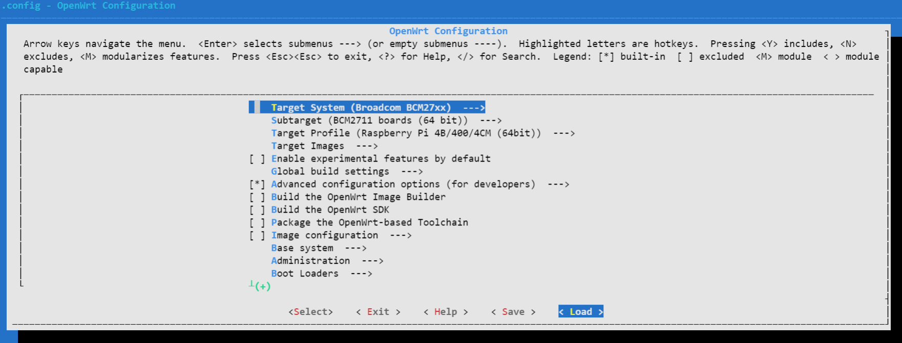


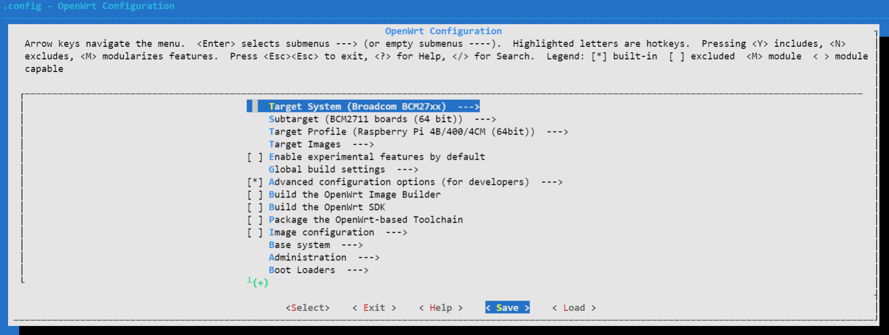


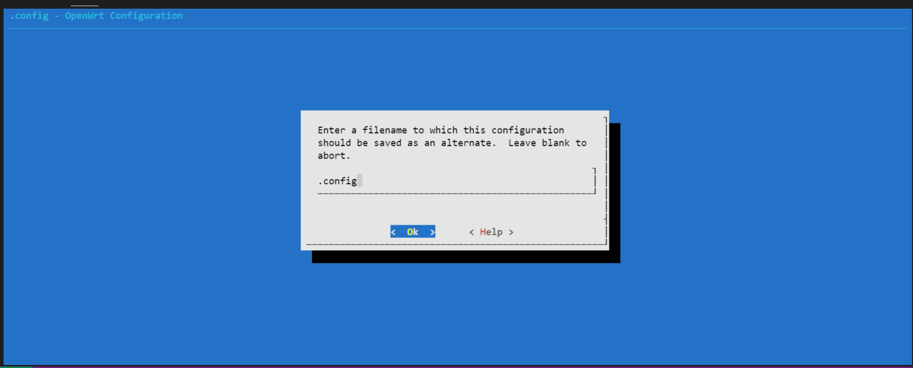


4. 在載入OpenWrt組態檔之後進行編譯，視您的機器能力不同，編譯的時間需數十分鐘不等。

   ```shell
   $cd ~/workspace/openwrt/
   #若編譯途中產生錯誤，請移除-j$(nproc)進行除錯
   $make -j$(nproc) V=s 
   ```

   

5. 若編譯完成並沒有產生任何錯誤，您可以在此目錄下找到**openwrt-bcm27xx-bcm2711-rpi-4-squashfs-factory.img.gz**。

   ```shell
   $cd ~/workspace/openwrt/bin/targets/bcm27xx/bcm2711-glibc/
   $ls
   config.buildinfo                                      openwrt-bcm27xx-bcm2711-rpi-4-squashfs-factory.img.gz     profiles.json
   feeds.buildinfo                                       openwrt-bcm27xx-bcm2711-rpi-4-squashfs-sysupgrade.img.gz  sha256sums
   openwrt-bcm27xx-bcm2711-rpi-4-ext4-factory.img.gz     openwrt-bcm27xx-bcm2711-rpi-4.manifest                    version.buildinfo
   openwrt-bcm27xx-bcm2711-rpi-4-ext4-sysupgrade.img.gz  packages
   ```

   

6. 準備一個空的SD card，建議容量大於32GB，在本文中我們使用的是**balenaEtcher**來進行映像檔的刷入，您可以從此[鏈結](https://www.balena.io/etcher/)下載balenaEtcher。

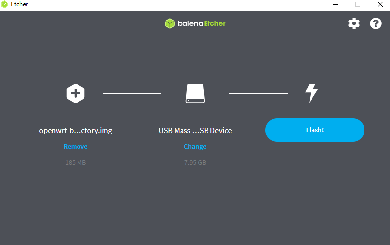


### Raspberry Pi 4

在製作完OpenWrt SD card之後，將其插入Raspberry Pi 4進行開機，第一次開啟時您必須使用鍵盤與螢幕來進行Raspberry Pi 4上OpenWrt的設定，以便進行後續AWS IoT Greengrass Version 2的運行與範例演示。請注意：OpenWrt預設使用者為root，預設沒有密碼，本文中使用是預設的root權限，登入系統後之命令列提示為井字號 **#**。

1. 請參照下列指令與設定進行OpenWrt上的網路介面設定。

   ```shell
   #cd /etc/config
   #vi network
   ```

   在此檔案最後加入下列兩行設定，儲存並離開。

   ```shell
   config interface 'wan'
   	option proto 'dhcp'
   ```

   

2. 本文在Raspberry Pi 4使用無線網路來存取網際網路的資源，請參照下列指令與設定進行OpenWrt上的無線網路設定。

   ```shell
   #cd /etc/config
   #vi wireless
   ```

   在此檔案上註記掉原本的無線網路設定，並根據您的無線網路環境增加設定。

   ```shell
   #請根據您的無線網路環境修改channel, band與htmode參數
   config wifi-device 'radio0'
   	option type 'mac80211'
   	option path 'platform/soc/fe300000.mmcnr/mmc_host/mmc1/mmc1:0001/mmc1:0001:1'
   	option channel '11'
   	option band '11g'
   	option htmode 'HT20'
   	option disabled '0'
   
   #您可以選擇註記或刪除下列原始的無線網路設定
   #config wifi-iface 'default_radio0'
   	#option device 'radio0'
   	#option network 'lan'
   	#option mode 'ap'
   	#option ssid 'OpenWrt'
   	#option encryption 'none'
   
   #請根據您的無線網路環境修改your_ap_ssid與your_wifi_password，其中your_ap_ssid是您的無線網路AP SSID，your_wifi_password是您的無線網路密碼
   config wifi-iface
   	option mode 'sta'
   	option device 'radio0'
   	option network 'wan'
   	option ssid 'your_ap_ssid'
   	option encryption 'psk2'
   	option key 'your_wifi_password'
   ```

   

3. 當您設置完網路介面與無線網路之後，重啟OpenWrt的網路服務使其生效。

   ```shell
   #service network restart
   #ping www.amazon.com
   PING www.amazon.com (23.208.81.175) 56(84) bytes of data.
   64 bytes from 23.208.81.175: icmp_seq=1 ttl=117 time=60.8 ms
   64 bytes from 23.208.81.175: icmp_seq=2 ttl=117 time=61.5 ms
   64 bytes from 23.208.81.175: icmp_seq=3 ttl=117 time=61.4 ms
   ```

   

4. 為了方便遠端操作OpenWrt，本文建議開啟ssh遠端登入，由於OpenWrt預設會開啟防火牆，在本文中我們會先行關閉防火牆進行遠端的登入，在運行本文中的範例之後，請您根據您原有的防火牆設定再次開啟防火牆。

   ```shell
   #service firewall stop
   ```

   

5. 透過遠端機器建立ssh連線連至您的OpenWrt，本文中使用**putty**來進行ssh連線，您可以從此[鏈結](https://www.putty.org/)下載putty。

   ```shell
   $ssh root@your_rpi_ip
   ```

   其中參數**your_rpi_ip**可以在OpenWrt內使用下列指令獲取。

   ```shell
   #ifconfig wlan0
   wlan0: Link encap: Ethernet HWaddr xx:xx:xx:xx:xx:xx
           inet 172.20.10.2  netmask 255.255.255.240  broadcast 172.20.10.15
           inet6 addr 2001:b011:200f:2234:b04d:63cd:bdc4:15a8/64  Scope:Link
           RX packets 0  bytes 0 (0.0 B)
           RX errors 0  dropped 0  overruns 0  frame 0
           TX packets 0  bytes 0 (0.0 B)
           TX errors 0  dropped 0 overruns 0  carrier 0  collisions
   ```

   登入之後的畫面會如下，其中OpenWrt的版本號會根據您當下所下載的原始碼不同而異。

   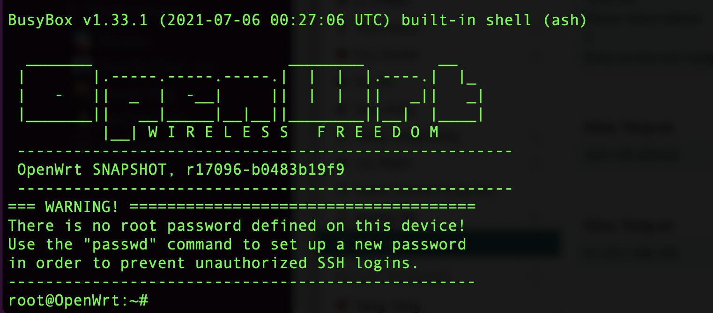

   

6. 由於AWS IoT Greengrass Version 2為JAVA的rumtime，在此需要下載JDK的環境以便後續運行AWS IoT Greengrass Version 2，本文使用的JDK為Amazon Corretto 11，請參考下列的指令下載並設定JAVA環境變數。

   ```shell
   #cd ~
   #curl -LO https://corretto.aws/downloads/latest/amazon-corretto-11-aarch64-linux-jdk.tar.gz
   #tar zxvf amazon-corretto-11-aarch64-linux-jdk.tar.gz
   #mv amazon-corretto-11.0.12.7.1-linux-aarch64 openjdk-11
   #export JAVA_HOME="/root/openjdk-11"
   #export PATH=$PATH:$JAVA_HOME/bin
   #java -version
   ```

   運行之後您將會看到如下圖所示Amazon Corretto 11資訊，其中Amazon Corretto 11的版本號會根據您當下所下載的檔案不同而異。

   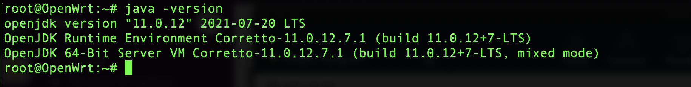

   

7. 您也可以將JAVA的參數寫入以下檔案，重新登入後使其永久生效。

   ```shell
   #vi /etc/profile
   ```

   於此檔案新增以下兩行

   ```shell
   export JAVA_HOME="/root/openjdk-11"
   export PATH=$PATH:$JAVA_HOME/bin
   ```


### AWS IoT Greengrass Version 2

在開始運行AWS IoT Greengrass Version 2之前，請參考此[鏈結](https://docs.aws.amazon.com/iot/latest/developerguide/iot-gs.html)確認您的AWS帳號與使用者具有針對AWS IoT與AWS IoT Greengrass Version 2的服務存取權限，本文假設您已經被賦予這些服務的存取權限。請您也留意您所選擇的AWS服務區是否有提供AWS IoT Greengrass Version 2的服務，您可以透過此[鏈結](https://docs.aws.amazon.com/general/latest/gr/greengrassv2.html)來確認。


1. 登入您的AWS控制台，搜尋IoT Core服務並點擊進入。

   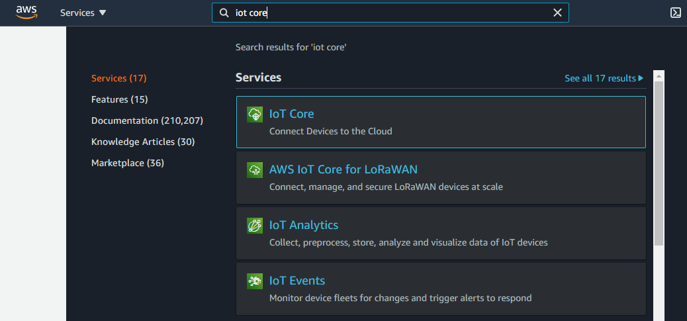

   登入IoT Core控制台後會如下圖所示。

   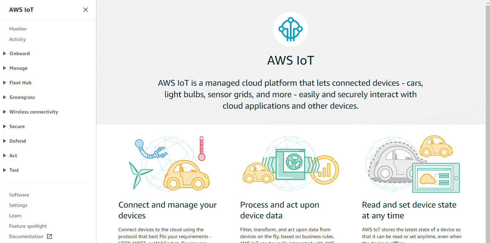

   

2. 若您登入後的主控台沒有顯示左手邊相關服務資訊列，請點擊左上方三條槓圖示以便展開。

   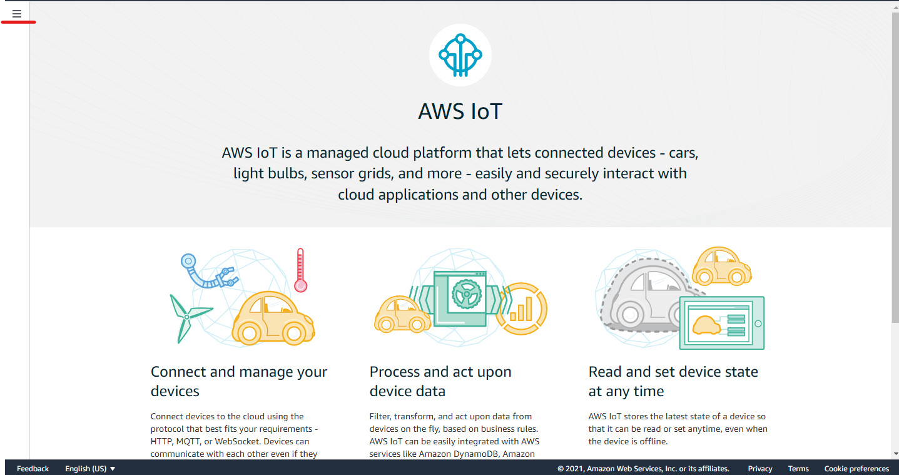

   

3. 點擊**Greengrass**展開服務，選擇**Getting started**之後在畫面右方點擊**Set up one core device**。

   

   

4. 在**Core device name**的欄位中輸入您想要的名稱，或者您可以選擇使用系統預設值。

   

   

5. 在**Thing group**中點選**Enter a new group name**並輸入您想要的群組名稱，或者您可以選擇使用系統預設值。

   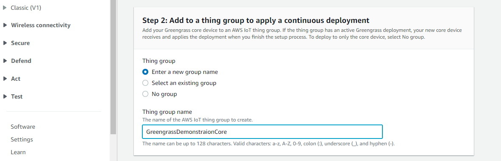

   

6. 往下捲動至**Run the installer**，點選**Copy**並記錄下此行指令，在後續的步驟將會使用到此指令。

   

   

7. 點擊**View core devices**。

   


### 開始運行AWS IoT Greengrass Version 2

在開始運行AWS IoT Greengrass Version 2之前，請先確認您可以取得AWS使用者帳號的存取金鑰(Access Key ID, AK)與秘密金鑰(Secret Key ID, SK)，您可以參考此[鏈結](https://docs.aws.amazon.com/powershell/latest/userguide/pstools-appendix-sign-up.html)獲得更多關於存取金鑰與秘密金鑰的資訊。

1. 登入您的OpenWrt，參考下列命令設定您的AWS存取金鑰與秘密金鑰。

   ```shell
   #export AWS_ACCESS_KEY_ID=your_aws_access_key_id
   #export AWS_SECRET_ACCESS_KEY=your_aws_secret_access_id
   ```

   

2. 下載AWS IoT Greengrass Version 2最新版本，其中AWS IoT Greengrass Version 2的版本號會根據您當下所下載的檔案不同而異。

   ```shell
   #cd ~/
   #curl -s https://d2s8p88vqu9w66.cloudfront.net/releases/greengrass-nucleus-latest.zip > greengrass-nucleus-latest.zip && unzip greengrass-nucleus-latest.zip -d GreengrassCore
   #java -jar ./GreengrassCore/lib/Greengrass.jar --version
   AWS Greengrass v2.5.0
   ```

   

3. 從雲端開始部署安裝AWS IoT Greengrass Version 2。請複製前面在AWS IoT控制台上的命令列，並修改成如下列範例開始進行部署。

   ```shell
   #cd ~/
   ##參數說明
   ##sudo -E：移除此參數，本文已經使用root權限登入OpenWrt
   ##--aws-region：請參考您所選取的AWS服務區域
   ##--thing-name：請參考您在上面章節所命名的AWS IoT Greengrass Core Name
   ##--thing-group-name：請參考您在上面章節所命名的AWS IoT Greengrass Group Name
   ##--setup-system-service：移除此參數，目前OpenWrt不支援
   ##--component-default-user：修改成root
   ##--provision：進行部署
   ##--deploy-dev-tools：進行額外AWS IoT Greengrass Command Line tools的部署
   #java -Droot="/greengrass/v2" -Dlog.store=FILE -jar ./GreengrassCore/lib/Greengrass.jar --aws-region your_aws_region --thing-name your_greengrass_core_name --thing-group-name your_greengrass_group_name --component-default-user root:root --provision true --deploy-dev-tools true
   ```

   當您成功部署與運行AWS IoT Greengrass Version 2之後，您應該會在終端畫面上看到如下圖所示的訊息。

   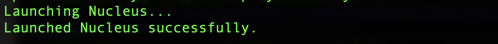

   

4. 檢查您是否成功運行AWS IoT Greengrass Version 2，請您參考下列的命令列，若尚未看到greengrass-cli，請稍等片刻在進行測試。

   ```shell
   #cd /greengrass/v2/bin
   #./greengrass-cli -h
   ```

   當您成功部署並執行了greengrass-cli之後，您應該會在終端畫面上看到如下圖所示的訊息。

   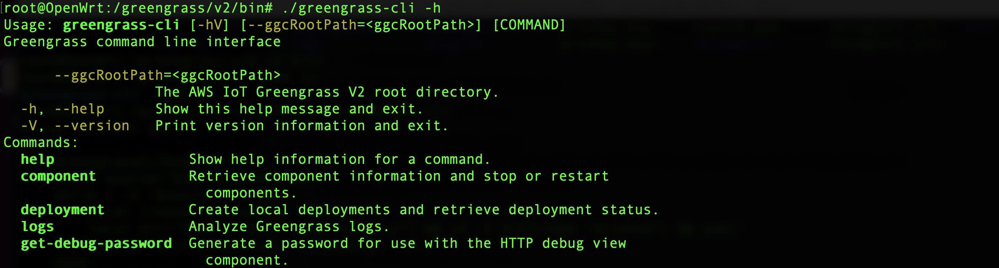

   

### 創建並部署第一個AWS IoT Greengrass Version 2的元件

在前面的章節，您已經成功的在OpenWrt上將AWS IoT Greengrass Version 2運行起來，並且透過命令列成功的部署了一個來自AWS IoT Greengrass Version 2的元件：Greengrass CLI，Greengrass CLI提供了一個在裝置端上的命令介面，讓您可以在裝置端輕鬆的開發並除錯任何在裝置端上部署的AWS IoT Greengrass Version 2元件，Greengrass CLI也可以讓您在裝置端直接部署新的元件或者重啟元件。接下來，我將帶您透過Greengrass CLI創建並從裝置端部署第一個AWS IoT Greengrass Version 2的範例元件，具體的架構圖如下。

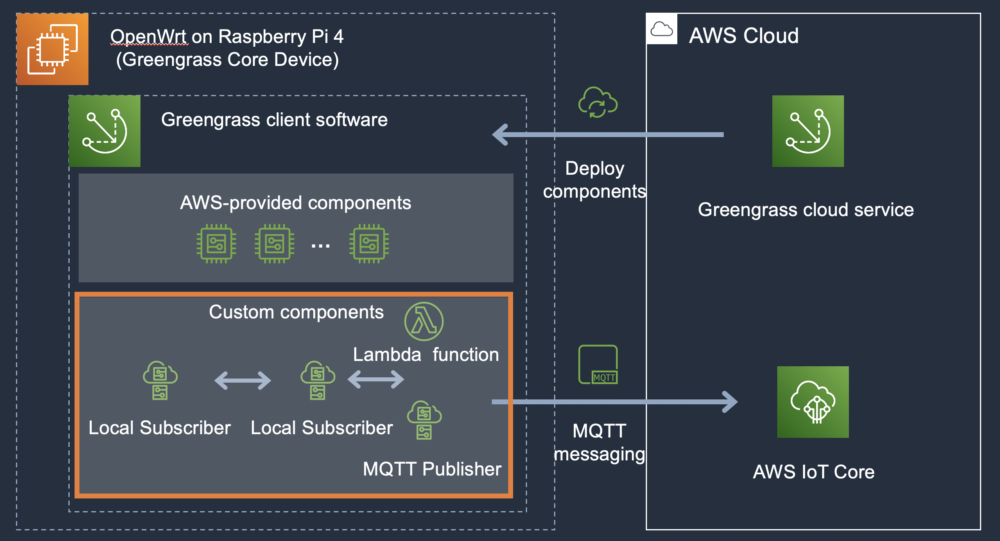


1. 透過遠端機器建立ssh連線連至您的OpenWrt，參考下列的命令列建置artifact的資料夾與python範例程式。

   ```shell
   ##請注意資料夾與範例程式的路徑，皆以前面章節為基礎，您可以按照您的需求修改位置
   #mkdir -p /root/GreengrassCore/artifacts/com.example.HelloWorld/1.0.0 && touch /root/GreengrassCore/artifacts/com.example.HelloWorld/1.0.0/hello_world.py
   ```


2. 使用編輯器開啟範例程式，並將以下範例程式碼貼上並儲存離開，此時範例程式應為空的內容。

   ```python
   # Copyright Amazon.com, Inc. or its affiliates. All Rights Reserved.
   # SPDX-License-Identifier: MIT-0
   import sys
   import datetime
   import time
   
   while True:
       
       message = f"Hello, {sys.argv[1]}! Current time: {str(datetime.datetime.now())}."
       
       # Print the message to stdout.
       print(message)
       
       # Append the message to the log file.
       with open('/tmp/Greengrass_HelloWorld.log', 'a') as f:
           print(message, file=f)
           
       time.sleep(1)
   ```

   

3. 參考下列的命令創建您元件的範例食譜(recipe)，此例子使用的是JSON格式，您也可以使用YAML格式來撰寫您的食譜。

   ```shell
   ##請注意資料夾與範例程式的路徑，皆以前面章節為基礎，您可以按照您的需求修改位置
   #mkdir -p /root/GreengrassCore/recipes && touch /root/GreengrassCore/recipes/com.example.HelloWorld-1.0.0.json 
   ```


4. 使用編輯器開啟範例食譜，並將以下範例內容貼上並儲存離開，此時範例食譜應為空的內容。

   ```json
   {
      "RecipeFormatVersion": "2020-01-25",
      "ComponentName": "com.example.HelloWorld",
      "ComponentVersion": "1.0.0",
      "ComponentDescription": "My first AWS IoT Greengrass component.",
      "ComponentPublisher": "Amazon",
      "ComponentConfiguration": {
         "DefaultConfiguration": {
            "Message": "world"
         }
      },
      "Manifests": [
         {
            "Platform": {
               "os": "linux"
            },
            "Lifecycle": {
               "Run": "python3 -u {artifacts:path}/hello_world.py '{configuration:/Message}'\n"
            }
         }
      ]
   }
   ```

   

5. 運行與測試您的元件，以下建議您開啟多個終端連線至OpenWrt，以利於您觀察範例的運行。

   ```shell
   ##請注意資料夾與範例程式的路徑，皆以前面章節為基礎，您可以按照您的需求修改位置
   ##開啟並監看AWS Greengrass Version 2日誌
   #tail -F /greengrass/v2/logs/greengrass.log
   ```

   

6. 登入另一個終端連線至OpenWrt，參考以下的命令透過Greengrass CLI從裝置端發起部署元件。

   ```shell
   ##請注意資料夾與範例程式的路徑，皆以前面章節為基礎，您可以按照您的需求修改位置
   #/greengrass/v2/bin/greengrass-cli deployment create --recipeDir /root/GreengrassCore/recipes --artifactDir /root/GreengrassCore/artifacts --merge "com.example.HelloWorld=1.0.0"
   ```

   當您看到類似以下的訊息，代表此元件的部署已完成

   


7. 參考以下的命令觀看此元件的日誌。

   ```shell
   ##範例python程式hello_world.py會持續列印訊息輸出至/tmp/Greengrass_HelloWorld.log
   #tail - F /tmp/Greengrass_HelloWorld.log
   ```

   當您看到類似以下的訊息，代表此範例元件已成功部署並運行。

   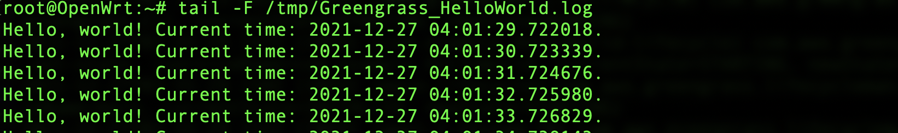


### 透過AWS CLI打包並發佈AWS IoT Greengrass Version 2元件

您已經在前一章節成功從裝置端創建並部署了第一個AWS IoT Greengrass Version 2的元件，以下我將帶您透過AWS CLI命令列打包您的元件並發佈至AWS IoT Greengrass Version雲端服務，請注意此章節會使用到Amazon Simple Storage Service(Amazon S3)，請確認您的AWS帳號的使用者權限，您可參考此[鏈結](https://docs.aws.amazon.com/AmazonS3/latest/userguide/Welcome.html)了解更多Amazon S3。

1. 登入您已經安裝好AWS CLI命令列的機器，確保您可以使用AWS CLI命令列，您可以參考此鏈結設定您的AWS CLI。請參考下列指令來設定您的AWS CLI。

   ```shell
   $aws configure
   ```

   並於提示下輸入您AWS帳號的訊息，畫面如下。其中AWS Access Key ID與AWS Secret Access Key請參考先前的章節，Default region name則是輸入您所使用AWS服務的服務區。

   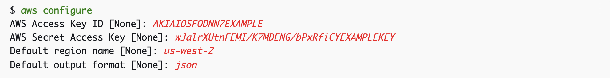


2. 請參考下列的命令創建Amazon S3的儲存貯體(bucket)並賦予儲存貯體名稱。

   ```shell
   #您可以按照您的需求給予儲存貯體名稱
   $EPOCH_TIME=$(date -d '06/12/2021 07:21:22' +"%s") && S3_BUCKET=ggcv2-sample-bucket-$HOSTNAME-$EPOCH_TIME && aws s3 mb s3://$S3_BUCKET
   ```

   

3. 登入您的OpenWrt並修改前面章節創立的食譜。

   ```shell
   ##請注意資料夾與範例程式的路徑，皆以前面章節為基礎，您可以按照您的需求修改位置
   #vi /root/GreengrassCore/recipes/com.example.HelloWorld-1.0.0.json
   ```

    

4. 參考下列範例修改您的食譜。其中請以步驟2中的S3_BUCKET名稱置換[YOUR BUCKET NAME]

   ```json
   {
      "RecipeFormatVersion": "2020-01-25",
      "ComponentName": "com.example.HelloWorld",
      "ComponentVersion": "1.0.0",
      "ComponentDescription": "My first AWS IoT Greengrass component.",
      "ComponentPublisher": "Amazon",
      "ComponentConfiguration": {
         "DefaultConfiguration": {
            "Message": "world"
         }
      },
   "Manifests": [
         {
            "Platform": {
               "os": "linux"
            },
            "Lifecycle": {
               "Run": "python3 -u {artifacts:path}/hello_world.py '{configuration:/Message}'\n"
            },
            "Artifacts": [
               {
                  "URI": "s3://[YOUR BUCKET NAME]/artifacts/com.example.HelloWorld/1.0.0/hello_world.py"
               }
            ]
         }
      ]
   }
   ```

   其中請以步驟2中的S3_BUCKET名稱置換[YOUR BUCKET NAME]，可參考下列的指令獲取S3_BUCKET名稱。

   ```shell
   $echo $S3_BUCKET
   ```

   

5. 登入您的OpenWrt，請參考下列的指令壓縮打包GreengrassCore資料夾並上傳至遠端機器。

   ```shell
   ##請注意資料夾與範例程式的路徑，皆以前面章節為基礎，您可以按照您的需求修改位置
   #cd /root/
   ##您可以按照您的需求決定壓縮包的名稱，或使用您習慣的壓縮工具
   #tar zcvf GreengrassCore.tgz ./GreengrassCore
   ##您可以按照您的需求，使用您習慣的檔案上傳工具，在此範例中我們使用scp，其中user為遠端機器的使用者名稱，remote_machine_ip為遠端機器的ip位址，/home/user/為遠端機器的指定目錄
   #scp ./Greengrass.tgz user@remote_machine_ip:/home/user/
   ```

   

6. 登入您遠端的機器，請參考下列指令解壓縮您剛剛上傳的GreengrassCore檔案，並透過AWS CLI上傳您元件的artifacts至Amazon S3儲存貯體。

   ```shell
   ##請注意資料夾與範例程式的路徑，皆以前面章節為基礎，您可以按照您的需求修改位置
   $cd /home/user/
   $tar zxvf GreengrassCore.tgz
   $aws s3 cp --recursive /home/user/GreengrassCore/ s3://$S3_BUCKET/
   ```


7. 請參考下列的命令發佈您的AWS IoT Greengrass Version 2元件。

   ```shell
   ##請注意資料夾與範例程式的路徑，皆以前面章節為基礎，您可以按照您的需求修改位置
   $cd /home/user/GreengrassCore/recipes
   $aws greengrassv2 create-component-version  --inline-recipe fileb://com.example.HelloWorld-1.0.0.json
   ```

   您應該會得到與下列相似的返回值。其中arn會根據您AWS使用者帳號不同而異。

   ```json
   {
       "arn": "arn:aws:greengrass:eu-west-1:xxxxxxxxxxxxxxxxx:components:com.example.HelloWorld:versions:1.0.0",
       "componentName": "com.example.HelloWorld",
       "componentVersion": "1.0.0",
       "creationTimestamp": 1617825194.539,
       "status": {
           "componentState": "REQUESTED",
           "message": "NONE",
           "errors": {}
       }
   }
   ```


8. 登入您的AWS IoT Core終端，您可以從**Greengrass**中的**Components**看到您已發佈的元件。

   


### 參考資料

https://docs.aws.amazon.com/greengrass/v2/developerguide/getting-started.html

https://catalog.us-east-1.prod.workshops.aws/v2/workshops/5ecc2416-f956-4273-b729-d0d30556013f/en-US/


